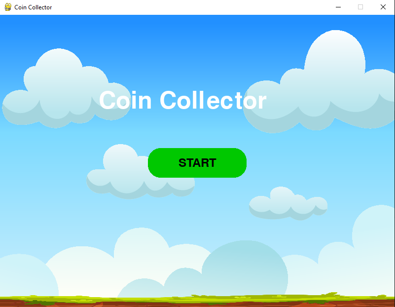
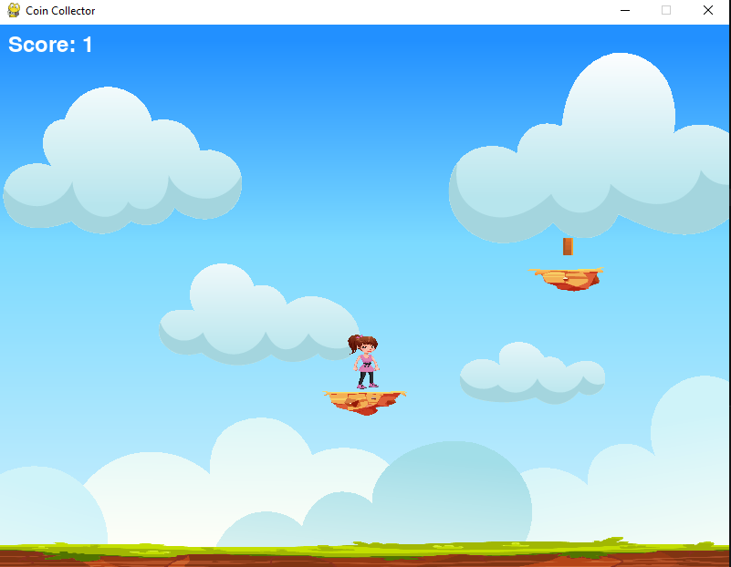
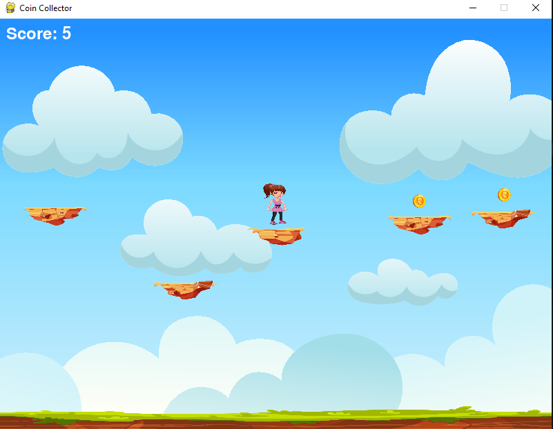
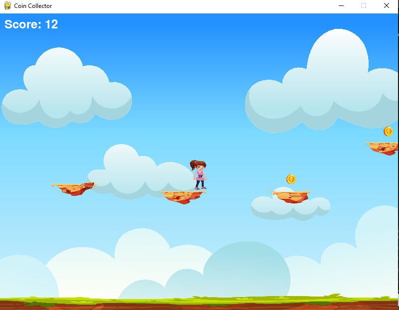
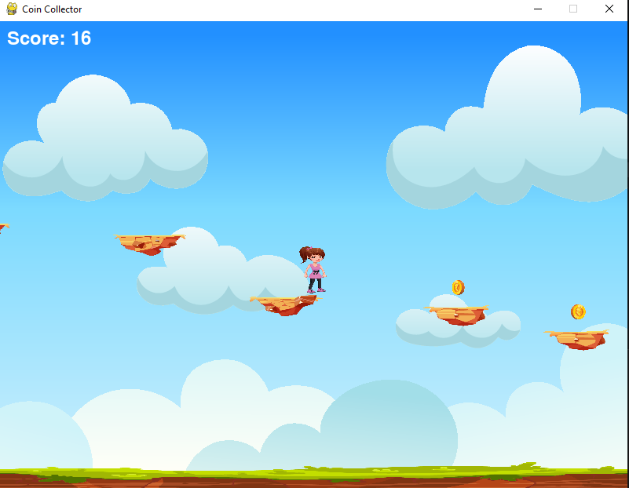
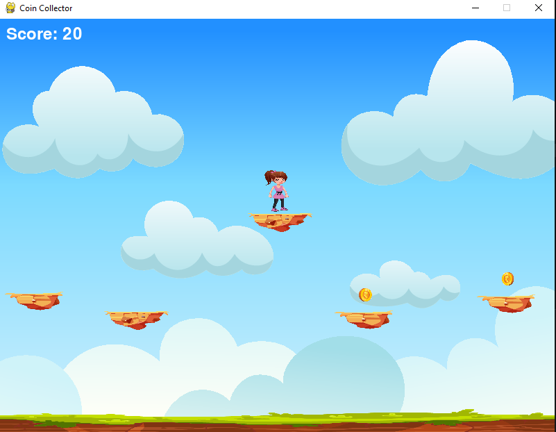
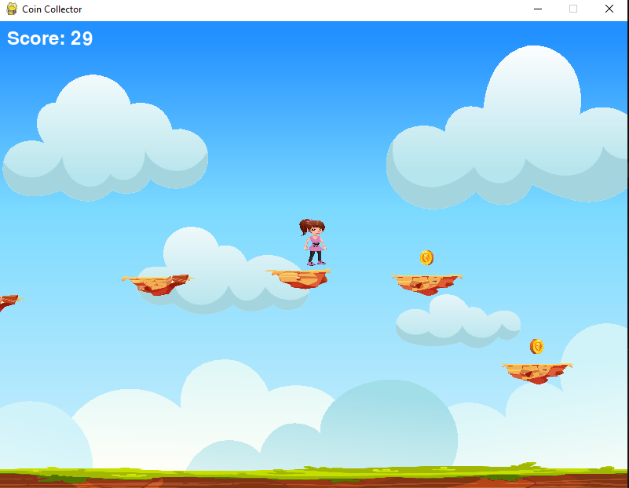
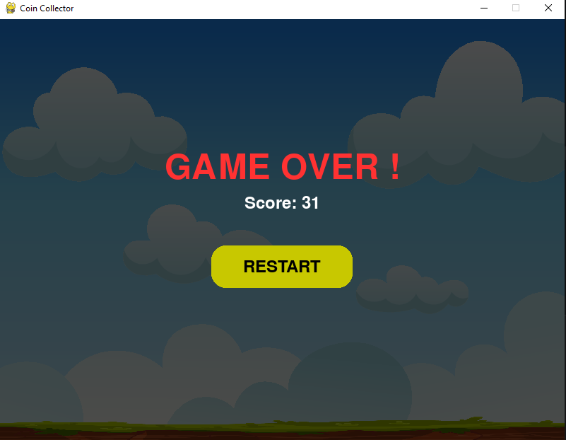

# 🎮 Coin Collector Game

A fun 2D platformer game built using **Pygame** where the player jumps across platforms, collects coins, and avoids falling!

---

## 🚀 Features

- Smooth player movement & jumping  
- Procedurally generated platforms  
- Animated coin collection system  
- Camera scrolling system  
- Game Over screen with restart  
- Animated UI buttons (Start & Restart)  
- Background music & sound effects  

---

## 🎮 Controls

- ⬅️ / A → Move Left  
- ➡️ / D → Move Right  
- ⬆️ / SPACE → Jump  

---

## ▶️ How to Run

1. Install Python (3.x)
2. Install Pygame:
   `pip install pygame`
3. Run the game:
   `python main.py`

---

## 📁 Project Structure

```
coin_platformer/
│
├── assets/ 
├── main.py 
├── player.py
├── tile.py 
├── coin.py 
├── camera.py
├── settings.py
├── README.md
└── .gitignore
```
---


## 📸 Screenshots

### 🚀 Start Screen
<p align="center">
  
</p>

### 🎮 Gameplay
<table>
  <tr>
    <td></td>
    <td></td>
    <td></td>
  </tr>
  <tr>
    <td></td>
    <td></td>
    <td></td>
  </tr>
</table>

### 🚩 Game Over Screen
<p align="center">
  
</p>

---

## 👩‍💻 Author

**Ira Singh Parmar**

---

## ⭐ Show Some Support

If you like this project, give it a ⭐ on GitHub!

